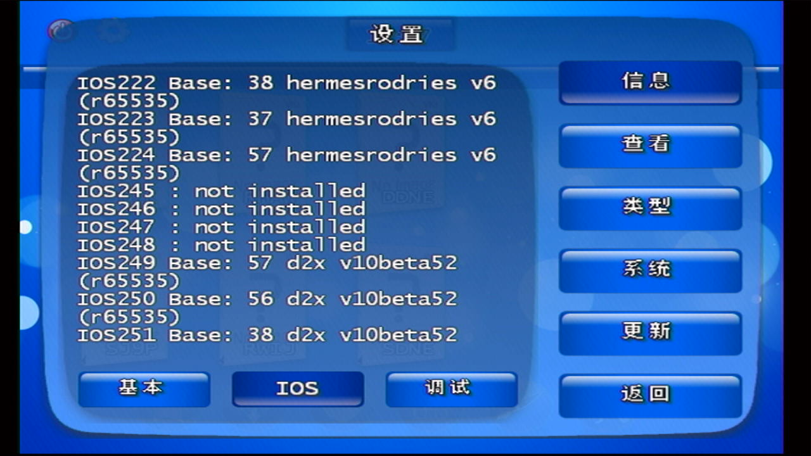
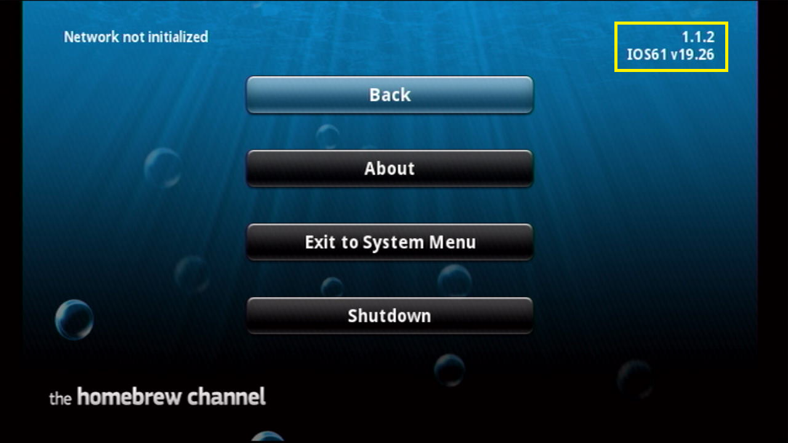
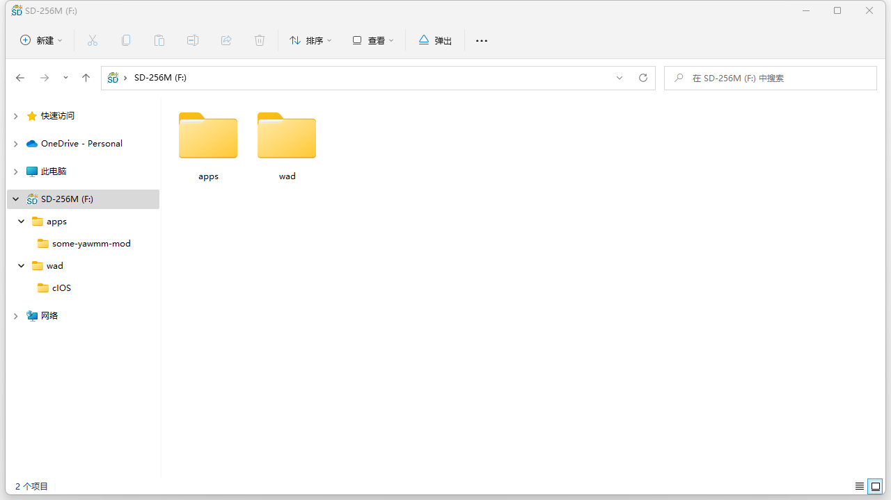
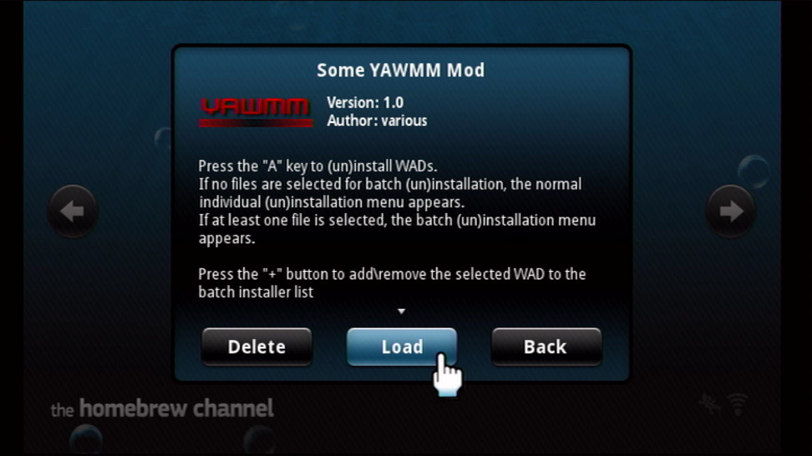
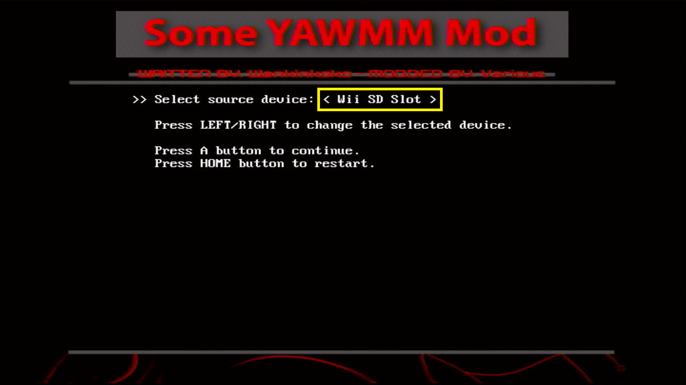
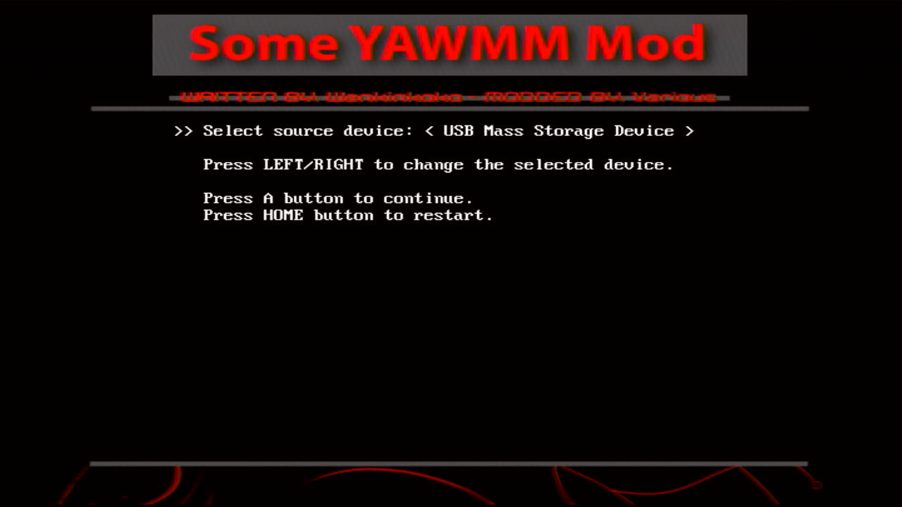
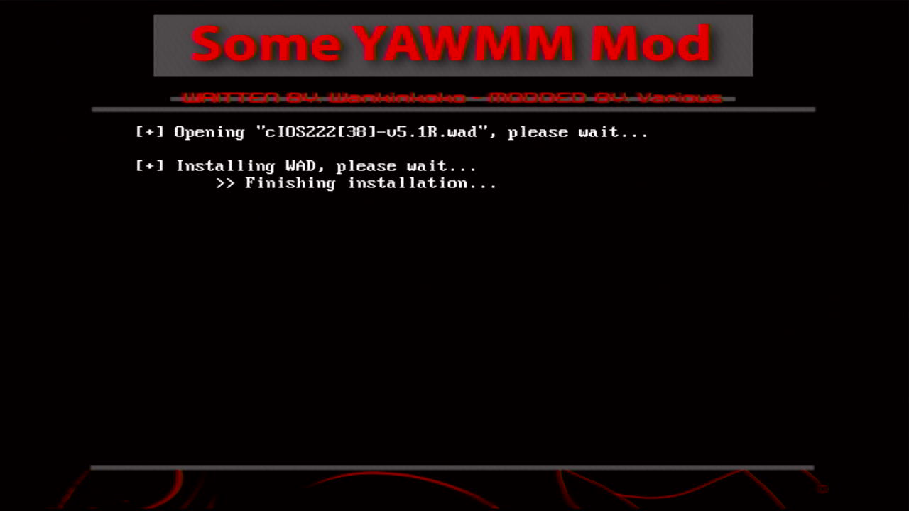
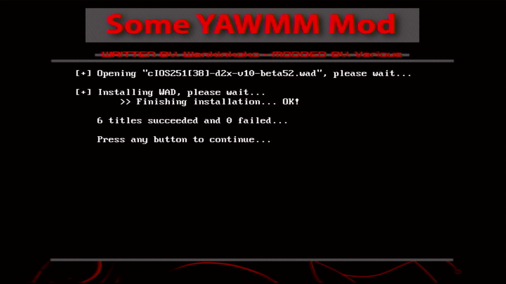

# 安装 USB Loader 使用的 cIOS

## 一、概述

Wii 主机会使用不同的 IOS 来加载光驱里的 Wii 游戏光盘。Wii 使用的 IOS，任天堂在主机出厂或者系统升级的时候会帮我们安装好。

相应的，USB Loader 也需要使用不同的 cIOS 来加载 SD 卡或者 USB 设备上的 Wii 游戏（.wbfs）文件。USB Loader 使用的 cIOS，需要我们自己动手安装。

USB Loader 使用的 cIOS 主要有 6 个：

笔者在 4.0 和 4.3 系统中安装好 **Homebrew Channel**（以下简称 **HBC**） 之后，即可使用 **Some YAWMM Mod** 成功安装 cIOS。如果你还在使用老版本的 **HBC**，强烈建议你先把 **HBC** 升级到 v1.1.2 或以上版本，再继续后面的操作。

  

## 二、懒人包

> [点击下载](./cios-for-usb-loader.zip)

懒人包里包含以下文件：

| 文件 | 出处 |
| --- | --- |
| **Some YAWMM Mod** | <https://github.com/FIX94/Some-YAWMM-Mod> |
| cIOS 安装文件 （.wad 格式） | <https://github.com/modmii/modmii.github.io> |

## 三、安装步骤

1. 把懒人包（.zip 文件）解压缩到 SD 卡或者 USB 设备的根目录：
  

2. 在 **HBC** 运行 **Some YAWMM Mod**：
  

3. 一般情况下，APP 启动之后会进入 **Select source device** 界面
    - 通过 SD 卡安装的选择 **Wii SD Slot**：
    
    - 通过 USB 设备安装的选择 **USB Mass Storage Device**：
    

4. 进入 `wad/cIOS` 文件夹，先按遥控器手柄上的 [+] 号键，把文件夹下的 6 个 .wad 文件逐个选上，再按 [A] 键启动安装（这一步需要注意的是，选好 .wad 文件之后，如果 >> 指向 [..]，此时按 [A] 键不会启动安装，而是会回到上一级文件夹）：
  

5. 耐心等待安装结束：
  

6. 看到以下界面即表示安装成功：
  

7. 不断按 [B] 键回到 **Select source device** 界面，再按 [HOME] 键退出 APP。 
