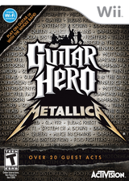

# 乐队游戏 吉他英雄系列

## 一、封面

|  |  |  |  |
| :---: | :---: | :---: | :---: |
| 吉他英雄3 摇滚传奇(美) | 吉他英雄 空中铁匠乐队(美) | 吉他英雄 世界巡演(美) | 吉他英雄 金属乐队(美) |

|  |  |  |  |
| :---: | :---: | :---: | :---: |
| 吉他英雄 流行精选(美) | 吉他英雄5(美) | 吉他英雄 范海伦(美) | 吉他英雄6 摇滚战士(美) |

## 二、详情

| | 发布时间 | 中文名 | 英文名 | ID |
| --- | --- | --- | --- | --- |
| 1 | 2007/10/29 | 吉他英雄3 摇滚传奇(美) | Guitar Hero III: Legends of Rock | RGHE52 |
| 2 | 2008/06/29 | 吉他英雄 空中铁匠乐队(美) | Guitar Hero: Aerosmith | RGVE52 |
| 3 | 2008/10/26 | 吉他英雄 世界巡演(美) | Guitar Hero: World Tour | SXAE52 |
| 4 | 2009/03/29 | 吉他英雄 金属乐队(美) | Guitar Hero: Metallica | SXBE52 |
| 5 | 2009/06/16 | 吉他英雄 流行精选(美) | Guitar Hero: Smash Hits | SXCE52 |
| 6 | 2009/08/01 | 吉他英雄5(美) | Guitar Hero 5 | SXEE52 |
| 7 | 2009/12/22 | 吉他英雄 范海伦(美) | Guitar Hero: Van Halen | SXDE52 |
| 8 | 2010/09/24 | 吉他英雄6 摇滚战士(美) | Guitar Hero: Warriors of Rock | SXIE52 |