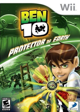
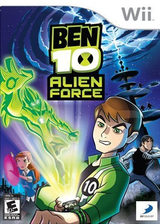
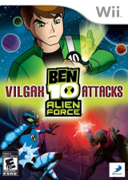
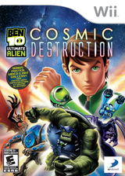
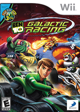
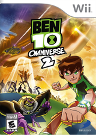

# 少儿游戏 少年骇客系列

## 一、封面

|  |  |  |  |
| :---: | :---: | :---: | :---: |
| 少年骇客 地球保卫者(美) | 少年骇客 外星英雄(美) | 少年骇客 外星英雄之魔賈斯袭击(美) | 少年骇客 终极异形之宇宙毁灭(美) |

|  |  |  |
| :---: | :---: | :---: |
| 少年骇客 银河赛车(美) | 少年骇客 全面进化(美) | 少年骇客 全面进化2(美) |

## 二、详情

| | 发布时间 | 中文名 | 英文名 | ID |
| --- | --- | --- | --- | --- |
| 1 | 2007/10/30 | 少年骇客 地球保卫者(美) | Ben 10: Protector of Earth | RBNEG9 |
| 2 | 2008/10/28 | 少年骇客 外星英雄(美) | Ben 10: Alien Force | RWTEG9 |
| 3 | 2009/10/27 | 少年骇客 外星英雄之魔賈斯袭击(美) | Ben 10: Alien Force Vilgax Attacks | SBNEG9 |
| 4 | 2010/10/04 | 少年骇客 终极异形之宇宙毁灭(美) | Ben 10: Ultimate Alien Cosmic Destruction | SBJEG9 |
| 5 | 2011/10/18 | 少年骇客 银河赛车(美) | Ben 10: Galactic Racing | SA6EG9 |
| 6 | 2012/11/13 | 少年骇客 全面进化(美) | Ben 10: Omniverse | S5TEG9 |
| 7 | 2013/11/10 | 少年骇客 全面进化2(美) | Ben 10: Omniverse 2 | SVYEG9 |
