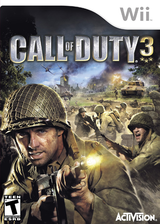
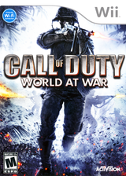
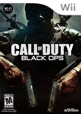
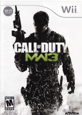

# 光枪游戏 使命召唤系列

## 一、封面

|  |  |  |
| :---: | :---: | :---: |
| 使命召唤3(美) | 使命召唤 战争世界(美) | 使命召唤 现代战争(美) |

|  |  |
| :---: | :---: |
| 使命召唤 黑色行动(美) | 使命召唤 现代战争3(美) |

## 二、详情

| | 发布时间 | 中文名 | 英文名 | ID |
| --- | --- | --- | --- | --- |
| 1 | 2006/11/19 | 使命召唤3(美) | Call of Duty 3 | RCDE52 |
| 2 | 2008/11/11 | 使命召唤 战争世界(美) | Call of Duty: World at War | RVYE52 |
| 3 | 2009/11/10 | 使命召唤 现代战争(美) | Call of Duty: Modern Warfare - Reflex Edition | RJAE52 |
| 4 | 2010/11/09 | 使命召唤 黑色行动(美) | Call of Duty: Black Ops | SC7E52 |
| 5 | 2011/11/08 | 使命召唤 现代战争3(美) | Call of Duty: Modern Warfare 3 | SM8E52 |
